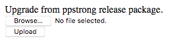

# Orion SC008HA Hacks
My recorded attempts at hacking the Oriona SC008HA IP camera

### Introduction

I was recently given an Orion SC008HA wiress IP surveillance camera by a friend who had no need for it. Knowing I was into home automation and enjoyed meddling with all things technology, he gave it to me in exchange for some home-made pasta sauces, a handful of Cat 6A ethernet cables, and a motion sensor for the light at his front door. Assuming I can get this working as I want, I consider that a good deal.

This repo simply documents my efforts to attempt to hack the camera so I can use it as a plain old RTSP camera wth my Home Assistant server, and not be tied to the application required to use it out of the box. I'm inspired, in part at least, by the efforts of @ant-thomas, who managed to (successfully) hack a ZS-GX1 camera [here](https://github.com/ant-thomas/zsgx1hacks).

### 2020-07-19 - First look
* Photos of the separated "head" and board can be found [here](./photos)

Externally, this camera mostly resembles the ZS-GX1, pictured [here](./img/zs-gx1.jpg), with the only notable exception being the lack of an ethernet socket on the back. Instead, there is only a single micro-USB socket for power.

Internally, there is no mainboard in the base of the camera. The only items of note in the base at the power cables from the USB socket and the 5V DC motor used for panning the camera.

The "head" of the camera separates with very little effort. With the camera lens pointing at you, gently pull the right side of the "head" casing away, being careful not to pull too far - there is a wireless antenna cable attached to the half that you're removing. Once the two halves are separated, you can use a fine blade screwdrive to gently prise off the antenna cable, and put the now separate casing to one side.

The board and lens bezel can now be removed from the remaining half of the "head" casing. With the wireless chip at the bottom left, we can see the following (clock face references used):

* Realteak RTL8188FTV wireless chip (6 o'clock)
* HiSilicon H13518ERNCV300 camera SoC (12 o'clock)
* 2-wire connector for speaker (1 o'clock)
* 4-wire connector for pan motor (3 o'clock)
* 4-wire connector for tilt motor (4 o'clock)
* 2-wire connector for USB power (5 o'clock)

No GPIO pins, or any other interface pads, appear to be available.

### 2020-10-01 - Attemping to find UART

So I left this on a corner of my workbench for a couple of months or so, then saw a post by @koutto on Reddit, linking to [this](https://github.com/koutto/hardware-hacking) brilliant starter tutorial, on hacking hardware devices.

(Re)inspired, I took a closer look at the camera board, and (using my previous clockface reference) I saw a row of 4 pads at 11 o'clock.  Time to take a closer look...

* Pad 1 (left): using the ground pin on the USB power connector, this pad is GND
* Pad 2: testing with GND pad, this appears to have a constant voltage of ~3.4V
* Pad 3: testing with GND pad, this appears to have a constant voltage of ~3.4V, slightly less than pad 2
* Pad 4: testing with GND pad, this appears to have a low, fluctuating voltage, between ~200mV and ~1.1V

So far, my first thoughts are that these are UART pins:

* Pin 1 = GND
* Pin 2 = 3.3V Vcc
* Pin 3 = likely Tx
* Pin 4 = likely Rx

Time to solder some header pins and hook it up to either a Raspberry Pi or an Arduino board, and see what I get.

Success ! (of sorts) - looks like I had Tx and Rx the wrong way around. Plugging them in to the UART pins on a Raspberry Pi and using screen to monitor the serial interface gives up:
```
hisi-sdhci: 0
PPS:Jul 22 2019 00:22:28 meari_c5    0 


please input password::
```

So, to recap, the pins are actually:

* Pin 1 = GND
* Pin 2 = 3.3V Vcc
* Pin 3 = Rx
* Pin 4 = Tx

Now to try brute forcing the password, which will likely be a nuisance, as the prompt  locks up after what looks like a 1 second timeout, unless you hit enter to get the password prompt.  More to come...

### 2020-10-01 (update 2) - Gaining access

After trying to brute force using a few lists I found around the place, I started researching what detail I could about the device, as there were very few markings on the outside.

Searching around for the prompt (particularly the "meari_c5" part) eventually led me to discover the camera is made by Hangzhou Meari. Even better, I found [this](https://fccid.io/2AG7CMINI8C) FCC ID, with internal photos depicting a board that looks similar to the board in my camera.

My best guess at this stage is that the Orion SC008HA is a new variant of the Meari Mini 8C. Just in case, I grabbed the user manual and internal photos PDFs (you can find them [here](./fcc/)).

Also, when booting up with the reset button pressed, the output is this:

```
hisi-sdhci: 0
PPS:Jul 22 2019 00:22:28 meari_c5    0 
button
cmd:fatload mmc 0 0x42000000 ppsMmcTool.txt 1020
```

Maybe a clue as to something I can do with a file called ppsMmcTool.txt on the microSD card? More searching to do.

### 2020-10-03 - Found a webserver

So my serching eventually led me to [this](https://github.com/AMoo-Miki/homebridge-tuya-lan/issues/4) thread for Tuya homebridges.

I'll save you the effort of reading about all the passwords I tried but, I did manage to get access to the webserver running on port 80, using the below credentials that I found somewhere in the thread:

	user: admin
	password: 056565099
	
Visiting http://\<ip>/devices/deviceinfo (also found in the thread) yielded some JSON:

```
{
  "devname": "Smart Home Camera",
  "model": "Speed 5X",
  "serialno": "058023258",
  "softwareversion": "2.9.0",
  "hardwareversion": "S5X_H1_V10_F23",
  "firmwareversion": "ppstrong-c5-tuya2_arlec008-2.9.0.20190808",
  "authkey": "kX5WMUgvzRGagO35afpB1B2ySAX0AR6s",
  "deviceid": "pp0188d5a405c78fd88b",
  "pid": "aaa",
  "WiFi MAC": "74:ee:2a:69:22:e4"
}
```

Yes, I left a number of device-specific attributes intact.  I'm fine with it.  If I successfully hack this thing, it'll be a dumb RTSP camera on my IoT VLAN anyway without any internet access.

Anyway, it seems I'm another step closer.  More recon of this webserver is needed.

Further reading of the thread has me thinking this camera is very closely related, if not the same as, a similar camera sold at Walmart in the states, under the Merkury brand.  Another comment in the thread shows that visiting the URL http://\<ip>/search yields:

```
{
	"deviceName":	"058023258",
	"serialno":	"058023258",
	"sn":	"pp0188d5a405c78fd88b",
	"licenseUsed":	1,
	"licenseId":	"pp0188d5a405c78fd88b",
	"p2p_uuid":	"v2-0580232580000111A",
	"factory_code":	0,
	"factory_code_str":	"",
	"model":	"Speed 5X",
	"ip":	"192.168.40.115",
	"mask":	"255.255.255.0",
	"gw":	"192.168.40.1",
	"mac":	"74:ee:2a:69:22:e4",
	"interface":	"wlan0",
	"version":	"2.9.0"
}
```

Also, visiting http://\<ip\>/flash/upgrade/release_package takes me to a screen to upload new firmware:



A bunch of other URLs from this thread also work - here's the full list so far that seem to respond with something, rather than timing out or the browser getting a connection reset:

```
/devices/deviceinfo
/devices/reboot
/devices/temp_humidity/value

/flash/encryption
/flash/identity
/flash/upgrade/all
/flash/upgrade/ppstrong
/flash/upgrade/release_package
/flash/search

/proc/<anything_useful>
```

That last one is interesting - it seems to display the contents of just about anything you'd expect from /proc, eg. /proc/mounts gives:

```
rootfs / rootfs rw,size=15864k,nr_inodes=3966 0 0
proc /proc proc rw,relatime 0 0
sysfs /sys sysfs rw,relatime 0 0
tmpfs /dev tmpfs rw,relatime 0 0
devpts /dev/pts devpts rw,relatime,mode=600,ptmxmode=000 0 0
/dev/mtdblock6 /home/cfg jffs2 rw,relatime 0 0
```

/proc/devices gives:

```
Character devices:
  1 mem
  4 /dev/vc/0
  4 tty
  5 /dev/tty
  5 /dev/console
  5 /dev/ptmx
  7 vcs
 10 misc
 13 input
 29 fb
 89 i2c
 90 mtd
128 ptm
136 pts
180 usb
189 usb_device
204 ttyAMA
218 himedia
253 motor
254 Strnio

Block devices:
259 blkext
 31 mtdblock
179 mmc
```

Checking out /proc/net/tcp gives:

```
  sl  local_address rem_address   st tx_queue rx_queue tr tm->when retrnsmt   uid  timeout inode                                                     
   0: 00000000:1A0C 00000000:0000 0A 00000000:00000000 00:00000000 00000000     0        0 1247 1 c0f91080 100 0 0 10 0                              
   1: 00000000:0050 00000000:0000 0A 00000000:00000000 00:00000000 00000000     0        0 1129 1 c0f90000 100 0 0 10 0                              
   2: 7328A8C0:0050 7700A8C0:DD08 01 00000000:00000000 00:00000000 00000000     0        0 4415 1 c0f92100 23 4 32 10 -1                             
   3: 7328A8C0:C9D6 5A1FB812:22B3 01 00000000:00000000 02:00000BBB 00000000     0        0 1235 2 c0f90580 46 8 26 10 -1                             
   4: 7328A8C0:0050 7700A8C0:DD01 06 00000000:00000000 03:000003EB 00000000     0        0 0 3 c0c80260                                              
```

Which translates to ports 80, 6668 and 51670.  Obviously, 80 makes sense, and 6668 is a known port for Tuya devices, but 51670 doesn't do much, and nmap tells me it's closed.

Looking at /proc/net/udp gives:

```
  sl  local_address rem_address   st tx_queue rx_queue tr tm->when retrnsmt   uid  timeout inode ref pointer drops             
  132: 0100007F:E027 0100007F:E28C 01 00000000:00000000 00:00000000 00000000     0        0 1128 2 c2292f00 0                  
  201: 00000000:7D6C 00000000:0000 07 00000000:00000000 00:00000000 00000000     0        0 1351 2 c2293900 0                  
  211: 00000000:0E76 00000000:0000 07 00000000:00000000 00:00000000 00000000     0        0 1110 2 c2292780 0                  
  212: 7328A8C0:E177 00000000:0000 07 00000000:00000000 00:00000000 00000000     0        0 1266 2 c2293680 0                  
  212: 00000000:0E77 00000000:0000 07 00000000:00000000 00:00000000 00000000     0        0 1111 2 c2292a00 0                  
  233: 0100007F:E28C 0100007F:E027 01 00000000:00000000 00:00000000 00000000     0        0 1127 2 c2292c80 0                  
  255: 00000000:2FA2 00000000:0000 07 00000000:00000000 00:00000000 00000000     0        0 1350 2 c2293400 0                  
```

These translate to:

1. 57383
2. 32108
3. 3702
4. 57719
5. 3203
6. 57996
7. 12194

I'll keep sniffing around.  The Github thread I linked above is quite active, as of a couple of days ago, which is great.  I'll definitely be keeping an eye on it.
